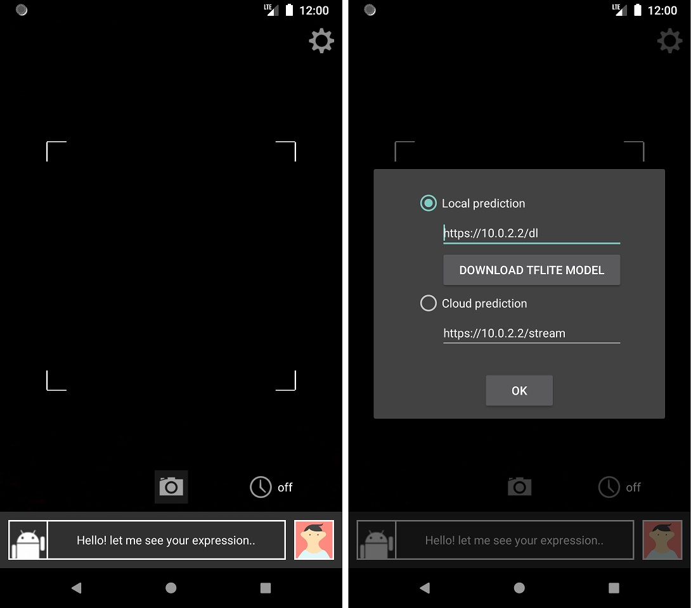

# Face Analytic Android (TFLite+Cloud)
  
Copyright 2020  I Made Agus Dwi Suarjaya (Jay)
  
## Description
Try to analyze face based on TFLite and cloud service into 7 expressions (angry, disgust, fear, happy, neutral, sad, surprise). This is my personal project separate from my team project of deep learning [Face Analytic (Expression) with TensorFlow](https://github.com/agussuarjaya/Face_Analytic_-Expression-) but related to the same web code ( python and flask ) for the cloud side.

## Screenshot
